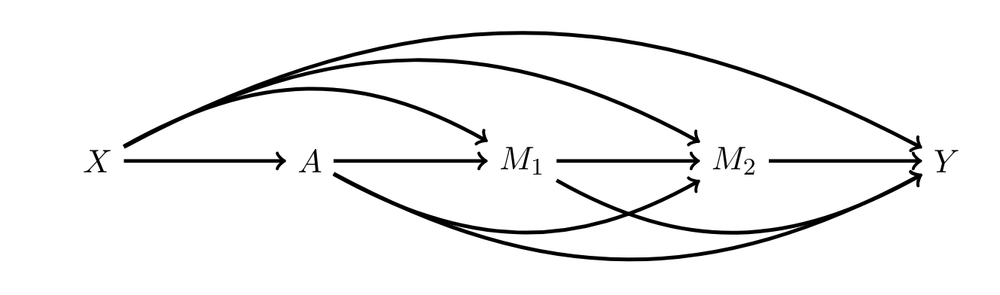

*This author of this paper is Professor Xiang Zhou from Harvard University.*

[Semiparametric Estimation for Causal Mediation Analysis with Multiple Causally Ordered Mediators](https://arxiv.org/abs/2011.12751)


# Introduction

Causal mediation analysis focuses on the pathways through which a treatment affects an outcome. As we know, most papers about mediating effect models involve one single mediator, which is simple and straightforward. However, there is a popular trend that more and more papers has examined the settings involving multiple mediators. 

What if there is more than one mediator? Can we still find the mediating effect in such models? Further more, Professor Xiang Zhou focuses on a much more complex setting where the model has multiple causally ordered mediators. He proposed a new semiparametric method whereby the path-specific effects (PSEs) could be estimated.


# Motivation

The author analyzed the causal pathways through which higher education affects political participation. 


Prior research suggests that college attendance has a substantial positive effect on political participation in the United States. Yet, the mechanisms underlying this causal link remain unclear. The effect of college on political participation may operate through the development of civic and political interest, through an increase in economic status, or through other pathways such as social and occupational networks.


# Settings

$A$ denotes the college attendance, which is the treatment; $Y$ denotes political participation, which is the outcome; $X$ denotes the covariates, including gender, ethnicity, age at 1997, parental education, parental income, and so on.

There are two mediator, economic status and civic and political interest, denoted by $M_1$ and $M_2$.

The graphical model is as follow.

```{r echo=FALSE, fig.align="center", fig.width=20, fig.height=20,warning=F}
library(knitr)

``` 

There are four possible causal paths existing from the treatment to the outcome:

```{r echo=FALSE, fig.align="center", fig.width=20, fig.height=20,warning=F}
library(knitr) 
include_graphics("./figures/possible_path.png")
``` 

# Question

The question is how to estimate the path-specific effects (PSEs) of the treatment, the college attendance, and the effect of two casually ordered mediators, economic status and civic and political interest.


